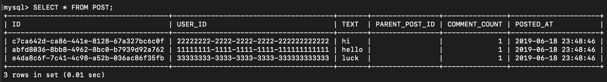
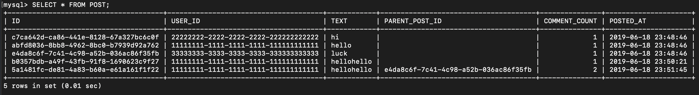
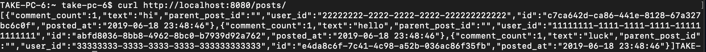
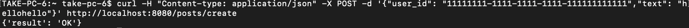
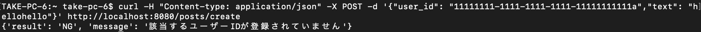
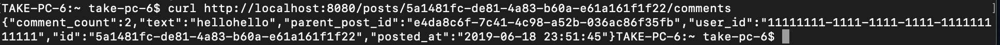
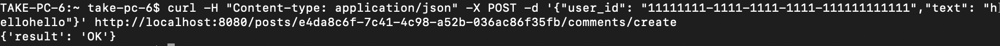
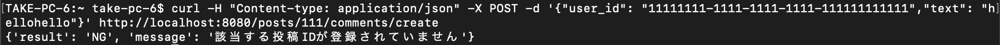

# README
## 仕様について
今回は課題書に書かれた機能をつけたAPIサーバーをscalaを用いて作成した。今回初めてscalaを触りスケーラブルな言語という意味を少し理解できたと思う。 
主な機能はTwitterのようなマイクロブログアプリケーションを作成するというものである。保存する先はMySQLを用いる。そのためDBとの非同期通信が必要になる。また、パスを応じてのルーティングやその処理も行う必要がある。

## できた部分
今回は時間内に指定した通りの仕様にすることはできなかった。そのためチェックコードでの評価が悪かった。しかし、必要な機能は全て設定することはできた。
それについて説明を行いたい。 
まず用いたDBのデータを表示する。最初の図が何も操作していない状態。もう一つの図が全操作を行った後の状態を指す。

### 1. GET /posts
このルーティングは全投稿の表示である。
仕様では、__{“posts”: [全投稿]}__ という形で出力する必要があるが、作成したAPIサーバーはDB内のデータをjson形式にして表示する。そのためjsonがワンラインになった。また、最初の__"post":__ を付けて表示していない。

### 2. POST /posts/create
このルーティングは投稿の作成にあたる。
仕様では成功時、__{“result”:”ok”}__ となり、失敗時、__{“result”:”NG”, “message”:[特定のエラー]}__ と表示する必要がある。作成したサーバーでは、成功、失敗の両方の場合において適切なメッセージを表示することができた。
今回はユーザーのIDを事前にDBに登録しておき、投稿がそのユーザーか否かを判断する必要がある。

### 3. GET /posts/:post_id/comments
このルーティングではクエリ上で指定したIDをもつ投稿を表示するというもの。
DBから該当する投稿を取得して表示することが必要になる。作成したサーバーでも適切に投稿を取得して表示することができた。

### 4. POST /posts/:post_id/comments/create
このルーティングではクエリ上で指定した投稿に対してのコメントを作成するというもの。
DBから該当する投稿があるかどうかを確認したあと、コメントを保存するということが求められる。またコメントをする投稿のcomment_countを増やすということも必要である。
作成したサーバーでも必要な動作を行うことができた。

## できなかった部分
1. 表示がうまくjson形式に整形できなかった。 
全投稿の表示はjsonとして表示できたが、postした時のメッセージやget,postのエラーメッセージがplain/text形式になってしまった。整形する方法を探したがうまく見つけることができなかった。

2. jsonの表示がうまくできなかった。 
全投稿の表示や該当のコメントを表示する際、DBからデータを取得することはできたがそれをそのまま出力するプログラムにしたため、要求される形で出力できなかった。
